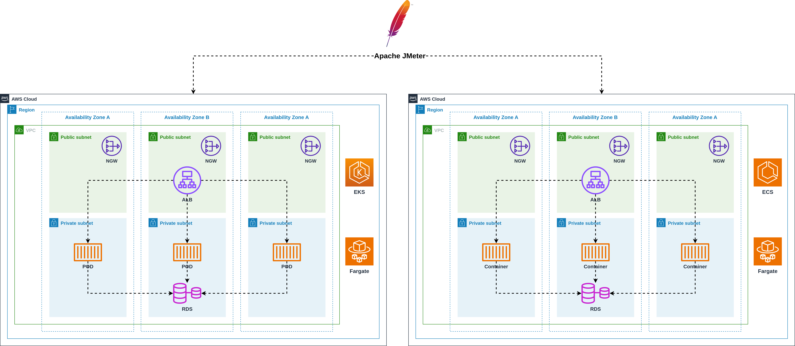

# AWS Community Day Peru 2024

<p align="center">
  
</p>

## **Prerrequisitos**

* [Instalar Terraform](https://www.terraform.io/downloads.html)
* [Instalar AWS CLI](https://docs.aws.amazon.com/cli/latest/userguide/cli-chap-install.html)
* [Instalar Helm](https://helm.sh/docs/intro/install/)
* [Instalar Kubectl](https://kubernetes.io/es/docs/tasks/tools/install-kubectl/#instalar-kubectl)

## **Variables**

| Name | Description | Type | Default | Required |
|------|-------------|------|---------|----------|
| `NAME` | Nombre del proyecto | string | `container-benchmark` | no |
| `AWS_DOMAIN` | Nombre del dominio DNS | string | `punkerside.io` | no |
| `AWS_DEFAULT_REGION` | Region de Amazon AWS | string | `us-east-1` | no |

## **Uso**

1. Crear imagenes de contenedores base

```bash
make base
```

2. Crear Red virtual privada en AWS

```bash
make vpc
```

3. Desplegando dependencias

```bash
make dependencies
```

4. Crear cluster ECS

```bash
make ecs
```

5. Crear cluster EKS

```bash
make eks
```

6. Configurando cluster EKS

```bash
make eks-config
```

7. Aprovisionando JMeter

```bash
# creando ami
make ami
# creando servidor
make jmeter
```

Para iniciar el servicio de VNC dentro del servidor JMeter, se debe conectar por medio de SSM y ejecutar el siguiente comando

```bash
vncserver :1
```

## Pruebas

1. Enviando informacion a las APIs

```bash
curl -X POST -H 'Content-Type: application/json' -d '{"name":  "Ivan Echegaray Avendaño", "email": "ivan.echegaray@outlook.com"}' https://ecs.punkerside.io/user
```

1. Consultar informacion de las APIs

```bash
curl https://ecs.punkerside.io/user
```

## Eliminar

```bash
make destroy
```

## Autor

[Ivan Echegaray Avendaño](https://github.com/punkerside/)